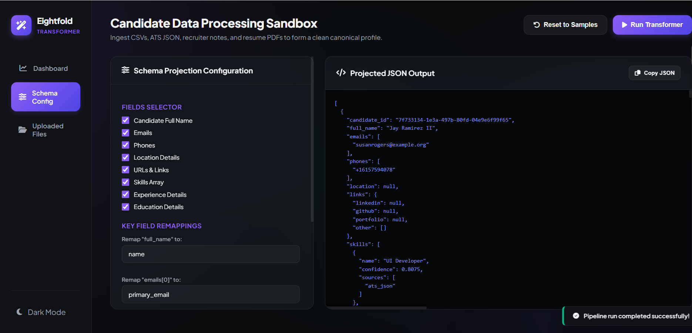

<div align="center">


<br /><br />

# 🧬 Multi-Source Candidate Data Transformer

### *Deterministic DAG pipeline — from multi-source chaos to canonical candidate records.*

Ingests **ATS JSON, Recruiter CSV, PDF Résumés, and Recruiter Notes** → resolves identity across sources → merges conflicts via a trust-weighted authority matrix → outputs a Pydantic-validated canonical JSON record with a full provenance audit trail.

<br />

🌐 **Live Demo:** [khusheeranjan01-1.onrender.com](https://khusheeranjan01-1.onrender.com) &nbsp;|&nbsp; 🎬 **Demo Video:** [Watch on Google Drive](https://drive.google.com/file/d/1L0PEq3vF4KCthBHRaOmiuwZM5UUWV083/view?usp=drive_link)



</div>

---

## Quick Start

```bash
git clone https://github.com/<your-username>/eightfold-transformer
cd eightfold-transformer
pip install -r requirements.txt
```

> `gliner` and `spacy` are optional — the pipeline degrades gracefully if absent.

### Run (CLI)

```bash
# Full canonical output
python cli.py --input-dir sample_inputs --output output/default.json

# With a custom projection config
python cli.py --input-dir sample_inputs --config custom_config.json --output output/custom.json
```

### Run (Web UI + API)

```bash
uvicorn server:app --reload --port 8000
# Then open frontend/index.html in your browser
```

### Run Tests

```bash
pytest tests/ -v
```

---

## Pipeline Architecture

The system runs as a **7-stage DAG**, ensuring dependencies are processed in order and a failure in one source never crashes the whole run.

```
ATS JSON ──┐
Recruiter CSV ──┤── [Stage 0–1] Extract ──► [Stage 2] Normalize ──► [Stage 3] Identity Resolve
Resume PDFs ──┤                                                              │ (NetworkX graph)
Notes ──────┘                                                               ▼
                                                                   [Stage 4] Merge
                                                                   (Authority Matrix)
                                                                              │
                                                          [Stage 5] Canonical Store (snapshot)
                                                                              │
                                                          [Stage 6] Projection Gate (Pydantic)
                                                                              │
                                                                       JSON Output
```

| Stage | What Happens | Key Tech |
|---|---|---|
| **0–1 Extract** | Layout parsing, GLiNER NER, FlashText skill trie, regex | PyMuPDF, GLiNER, FlashText |
| **2 Normalize** | Phone → E.164, Date → ISO-8601, Skill → canonical alias | libphonenumber, RapidFuzz |
| **3 Identity** | Graph clustering on shared email/phone — no false merges | NetworkX |
| **4 Merge** | `ATS > CSV > Resume > Notes` authority matrix; losers kept in provenance | Custom |
| **5 Store** | Immutable per-run snapshot written before projection | Filesystem |
| **6 Project** | Config-driven field selection + schema validation | Pydantic v2 |

**Merge conflict resolution** — the winning value is the one with the highest weighted source trust:

$$V_{final} = \arg\max_{v \in V} \sum_{s \in S} T_s \cdot \mathbb{1}(v, s)$$

**Confidence scoring** — every output record carries an aggregated confidence score:

$$C_a = \sum (w_i \cdot m_i \cdot \phi_i)$$

where $w_i$ = source trust weight · $m_i$ = method fidelity · $\phi_i$ = cross-source consensus bonus

---

## Produced Output

Running against `sample_inputs/` produces:

```
Run ID:              fb60e0c8c11b
Sources processed:   ['recruiter.csv', 'ats.json', 'notes/ (12/12 files)']
Sources skipped:     ['resumes/ (directory missing)']
Candidates produced: 500
Canonical snapshot:  output/canonical_fb60e0c8c11b.json
Output written to:   output/default.json
```

Each record in the output JSON looks like:

```json
{
  "candidate_id": "a4de8c49-b04c-45f1-bff4-5c53d6418178",
  "full_name": "Jay Ramirez II",
  "emails": ["susanrogers@example.org"],
  "phones": ["+16157594078"],
  "skills": [{ "name": "JavaScript", "confidence": 0.90, "sources": ["ats_json"] }],
  "experience": [{ "company": "JetBlue", "title": "Angular2 Software Developer", "start": null, "end": null }],
  "provenance": [
    { "field": "full_name",  "source": "ats_json", "method": "direct_field", "raw_value": "Jay Ramirez II", "confidence": 0.95 },
    { "field": "phones[0]",  "source": "ats_json", "method": "regex", "raw_value": "(615)759-4078x1618", "confidence": 0.57 }
  ],
  "overall_confidence": 0.8233,
  "source_records_merged": ["recruiter_csv", "ats_json"],
  "created_at": "2026-06-30T21:27:23.954744"
}
```

**Key fields:** `candidate_id` (stable UUID) · `phones` (E.164) · `provenance` (full audit trail per field) · `overall_confidence` (`Σ source_trust × method_fidelity × consensus`) · `source_records_merged`

---

## CLI Flags

| Flag | Required | Description |
|---|---|---|
| `--input-dir` | ✅ | Directory with `recruiter.csv`, `ats.json`, `notes/`, `resumes/` |
| `--output` | ✅ | Path to write the output JSON |
| `--config` | ➖ | Runtime projection config JSON (omit for full schema) |
| `--notes-dir` | ➖ | Override notes directory (default: `<input-dir>/notes`) |
| `--snapshot-dir` | ➖ | Where to write canonical snapshot (default: `output/`) |

---

## Tests

```bash
pytest tests/ -v
```

| File | Covers |
|---|---|
| `test_date_engine.py` | ISO-8601 normalization, "present" synonyms, chronological inversion swap, garbage → `None` |
| `test_skill_engine.py` | Alias lookup (`js→JavaScript`, `k8s→Kubernetes`), fuzzy misspellings, deduplication |
| `test_layout_parser.py` | Heading/bullet/body detection, indent levels, two-column PDF layout |
| `test_multilingual_identity.py` | Devanagari+Latin merge, Arabic+Latin merge, phone collision → no false merge, suffix stripping |
| `test_name_normalizer_multilingual.py` | Name key normalization, transliteration stability |
| `test_indent_edge_cases.py` | Mixed tabs/spaces, deeply nested bullets, single-line docs |
| `test_resume_extractor.py` | PDF extraction smoke tests |

---

## Assumptions & Descoped Items

**Assumptions:**
- Input directory follows the expected layout (`recruiter.csv`, `ats.json`, `notes/*.txt`, `resumes/*.pdf`). Missing files are skipped, not fatal.
- Identity resolution relies on **exact** email/phone matches as merge triggers — name similarity is a corroborating signal only.
- Source trust hierarchy is fixed: `ATS > CSV > Resume > Notes`.

**Descoped (under time constraints):**
- **Probabilistic/fuzzy identity matching** — excluded intentionally to guarantee 100% deterministic, reproducible output.
- **Full-scale OCR as primary path** — Tesseract is a break-glass fallback for unreadable PDF text layers only.
- **Horizontal/distributed scaling** — the architecture is optimized for high-performance single-machine batch processing.

---

## Tech Stack

`Python 3.10+` · `Pydantic v2` · `NetworkX` · `PyMuPDF` · `GLiNER` · `FlashText` · `RapidFuzz` · `libphonenumber` · `FastAPI` · `Tesseract (optional)` · `spaCy (optional)`

---

<div align="center">

Built by **Khushee Ranjan** · [khusheeranjan@gmail.com](mailto:khusheeranjan@gmail.com) · Eightfold Engineering Intern Assignment

</div>
